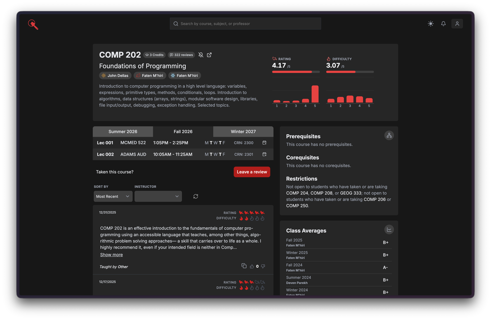

## mcgill.courses <a></a>

[](https://github.com/mcgill-courses/mcgill.courses/actions/workflows/ci.yaml)
[](https://codecov.io/github/mcgill-courses/mcgill.courses)
[](https://discord.gg/KcYbwyupmJ)
[](https://mcgill.courses/)

A course search and review platform for McGill university.



## Development

You'll need [docker](https://www.docker.com/),
[cargo](https://doc.rust-lang.org/cargo/) and [pnpm](https://pnpm.io/) installed
on your machine to spawn the various components the project needs to run
locally.

First, join the discord server to get access to the development environment
variables:

[https://discord.gg/fSVSqfPHSV](https://discord.gg/fSVSqfPHSV)

In `.env` within the root directory you'll have to set

```
MS_CLIENT_ID=
MS_CLIENT_SECRET=
MS_REDIRECT_URI=http://localhost:8000/api/auth/authorized
```

...and then in `client/.env` you'll have to set the server url

```
VITE_API_URL=http://localhost:8000
```

Second, mount a local [mongodb](https://www.mongodb.com/) instance with docker
and initiate the replica set:

```bash
docker compose up --no-recreate -d
```

Spawn the server with a data source (in this case the `/seed` directory) and
initialize the database (note that seeding may take some time on slower
machines):

```bash
cargo run -- --source=seed serve --initialize --db-name=mcgill-courses
```

Finally, spawn the react frontend:

```bash
pnpm install
pnpm run dev
```

_n.b._ If you have [just](https://github.com/casey/just) installed, we provide a
`dev` recipe for doing all of the above in addition to running a watch on the
server:

```bash
just dev
```

See the
[justfile](https://github.com/terror/mcgill.courses/blob/master/justfile) for
more recipes.

## Tools

We have a few tools that we use for project-specific maintenance tasks. You can
find all of them under the
[`tools`](https://github.com/terror/mcgill.courses/tree/master/tools) directory
from the project root.

For python-based tools, we highly recommend you install
[uv](https://docs.astral.sh/uv/) on your system. On macOS or linux, you can do
it as follows:

```bash
curl -LsSf https://astral.sh/uv/install.sh | sh
```

Follow the
[documentation](https://docs.astral.sh/uv/getting-started/installation/) for
other systems.

## Deployment

We continuously deploy our site with [Render](https://render.com/) using a
[docker image](https://github.com/terror/mcgill.courses/blob/master/Dockerfile),
and have a [MongoDB](https://en.wikipedia.org/wiki/MongoDB?useskin=vector)
instance hosted on [Atlas](https://www.mongodb.com/atlas/database).

We also use
[S3](https://aws.amazon.com/pm/serv-s3/?trk=936e5692-d2c9-4e52-a837-088366a7ac3f&sc_channel=ps)
to host a bucket for referring to a hash when deciding whether or not to seed
courses in our production environment, and Microsoft's
[identity platform](https://learn.microsoft.com/en-us/entra/identity-platform/v2-oauth2-auth-code-flow)
for handling our OAuth 2.0
[authentication flow](https://github.com/terror/mcgill.courses/blob/master/src/auth.rs).

## Prior Art

There are a few notable projects worth mentioning that are similar in nature to
[mcgill.courses](https://mcgill.courses), and have either led to inspiration or
new ideas with regard to its functionality and design, namely:

- [uwflow.com](https://uwflow.com/) - A course search and review platform for
  the University of Waterloo
- [cloudberry.fyi](https://www.cloudberry.fyi/) - A post-modern schedule builder
  for McGill students
- [mcgill.wtf](https://github.com/terror/mcgill.wtf) - A fast full-text search
  engine for McGill courses
