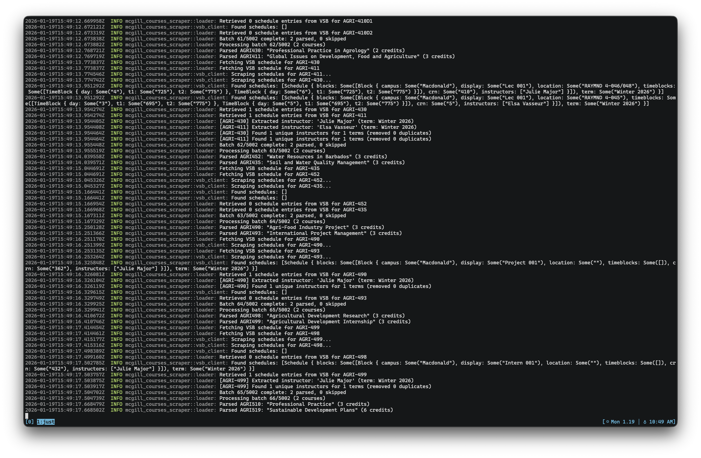

## scraper

**scraper** is the tool we use for fetching up-to-date course information from
various websites offered by McGill University. We primarily use this tool to
update course [seed files](https://github.com/mcgill-courses/mcgill.courses/tree/master/seed), which is course information data that makes it into our production database.



The primary source is the [McGill Course Catalogue](https://coursecatalogue.mcgill.ca)
, which provides course metadata (title, code, subject, credits, faculty, department), requirements (prerequisites,
corequisites, restrictions), and terms offered.

The [Visual Schedule Builder](https://vsb.mcgill.ca) is an optional
secondary source that provides schedule information (time blocks, locations,
campuses) and instructor assignments per term. VSB requires authentication via
Selenium.

## Usage

You can invoke `scraper` from within this directory as follows:

```bash
cargo run -- --batch-size 5 --course-delay 1000 --source seed --user-agent "Mozilla/5.0 ..."
```

The `--user-agent` flag is required. The `--source` flag specifies the
input/output path for course data (default: `courses.json`).

The `--batch-size` flag controls how many pages are scraped concurrently
(default: 20), and `--course-delay` adds a millisecond delay between requests
(default: 0). The `--retries` flag sets the number of HTTP retry attempts
(default: 10).

The `--mcgill-terms` flag specifies the academic year to scrape (default:
`2025-2026`). When `--scrape-vsb` is enabled, the `--vsb-terms` flag specifies
VSB term codes to scrape (default: `202505 202509 202601`).

## Authentication

When `--scrape-vsb` is enabled, the scraper launches a Selenium-controlled
Chrome browser to authenticate with McGill's identity provider. This requires
`chromedriver` to be installed and handles multi-factor authentication (TOTP).

Moreover, the following environment variables must be set:

| Variable | Description |
|----------|-------------|
| `VSB_EMAIL` | McGill email address |
| `VSB_PASSWORD` | McGill account password |
| `VSB_OTP_SECRET` | TOTP secret for multi-factor authentication |

## Output

JSON files containing course arrays are written to the `--source` path. The
scraper computes `leading_to` relationships from prerequisite data and merges
new data with existing courses.
